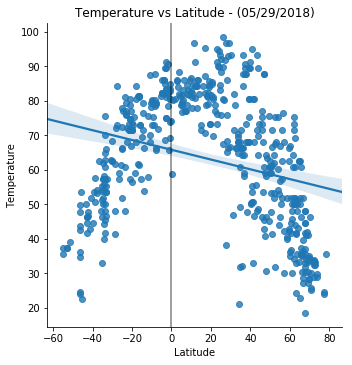

## Analysis

    Observed Trend 1: Temperature vs Latitude
                   Cities with higher tempertures are closer to the equator than cities with lower tempeatures.
    
    Observed Trend 2: Humidity vs Latitude
                   The observed trend is the same as Temperature vs Latitude.  Cities with higher humidity are closer to the equator than cities with lower humidity.
    
    Observed Trend 3: Cloudiness vs Latitude and Wind Speed vs Latitude, The observe trend is that for Cloudiness and Wind        Speed, proximity to the equator does not seem to matter.


```python
#Import Dependancies

from pprint import pprint
from citipy import citipy
from random import uniform

import random
import requests
import json
import openweathermapy.core as owm
from config_wm import api_key

import pandas as pd
import csv
import numpy as np

import matplotlib.pyplot as plt
import matplotlib
%matplotlib inline
import seaborn as sns

import logging
logging.basicConfig(filename="weatherpy.log",level=logging.DEBUG)

```


```python
# Save config information
url = "http://api.openweathermap.org/data/2.5/weather?"
settings = {"appid":api_key,"units":"imperial"}

```


```python
#Create Sample Data


lats_lons_df = pd.DataFrame()
cities_df = pd.DataFrame()
cities_list_df = pd.DataFrame()

#lats_lons_df
# x ---> Longitude(-180 +180)
# y ---> Latitude(-90  +90)
for x in range(50):
    row = x
    x, y = uniform(-180,180), uniform(-90, 90)
    gen_lats_lons_df = pd.DataFrame([[x,y]])
    lats_lons_df = lats_lons_df.append(gen_lats_lons_df)

lats_lons_df.index= range(len(lats_lons_df.index))
lats_lons_df.columns = ["Longitude","Latitude"]


#Select Cities - Cities_df
for i, row in lats_lons_df.iterrows():
    latitude = row["Latitude"]
    longitude = row["Longitude"] 
    city = citipy.nearest_city(row["Latitude"],row["Longitude"])
    city_name = city.city_name
    country_code = city.country_code
    gen_cities_df = pd.DataFrame([[city_name,country_code,latitude,longitude]])
    cities_df = cities_df.append(gen_cities_df)

cities_df.index= range(len(cities_df.index))
cities_df.columns = ["City","Country","Latitude","Longitude"]

cities_df

#Perform API Calls
for i, row in cities_df.iterrows():
    sel_city = (row["City"])
    sel_country = (row["Country"])
    settings["q"]=f'{row["City"]},{row["Country"]}'
    try:
        weather_resp = owm.get_current(**settings)
    except:
        sel_city = ""
        sel_country = ""
        pass
    print(weather_resp)
    w_lat = weather_resp.get("coord",{}).get("lat") 
    w_lon = weather_resp.get("coord",{}).get("lon") 
    temp = weather_resp.get("main",{}).get("temp_max")
    w_hum = weather_resp.get("main",{}).get("humidity")
    w_wind = weather_resp.get("wind",{}).get("speed")
    w_clouds = weather_resp.get("clouds",{}).get("all")
    w_city_id = weather_resp.get("id")
    w_city_name = weather_resp.get("name")
    logging.debug(f'Processing... {w_city_id},{w_city_name},{url}{settings["q"]},{settings["units"]}')
    wm_cities_df = pd.DataFrame([[sel_city,sel_country,w_lat,w_lon,temp,w_hum,w_wind,w_clouds]])
    cities_list_df = cities_list_df.append(wm_cities_df)

#Write to CSV File 
cities_list_df.columns = ["City","Country","Latitude","Longitude","Temperature","Humidity","Wind Speed","Cloudiness"]
with open("global_cities_weather_data.csv", "a") as f: 
    cities_list_df.to_csv(f, header=False)
#cities_list_df.to_csv("global_cities_weather_data.csv")
cities_list_df
    
```

    {'coord': {'lon': 147.33, 'lat': -42.88}, 'weather': [{'id': 801, 'main': 'Clouds', 'description': 'few clouds', 'icon': '02n'}], 'base': 'stations', 'main': {'temp': 46.4, 'pressure': 1013, 'humidity': 65, 'temp_min': 46.4, 'temp_max': 46.4}, 'visibility': 10000, 'wind': {'speed': 9.17, 'deg': 330}, 'clouds': {'all': 20}, 'dt': 1527620400, 'sys': {'type': 1, 'id': 8195, 'message': 0.0047, 'country': 'AU', 'sunrise': 1527542972, 'sunset': 1527576388}, 'id': 2163355, 'name': 'Hobart', 'cod': 200}
    {'coord': {'lon': 140.83, 'lat': 35.73}, 'weather': [{'id': 803, 'main': 'Clouds', 'description': 'broken clouds', 'icon': '04n'}], 'base': 'stations', 'main': {'temp': 65.08, 'pressure': 1015, 'humidity': 93, 'temp_min': 64.4, 'temp_max': 66.2}, 'visibility': 10000, 'wind': {'speed': 1.12, 'deg': 330}, 'clouds': {'all': 75}, 'dt': 1527622200, 'sys': {'type': 1, 'id': 7505, 'message': 0.0043, 'country': 'JP', 'sunrise': 1527535382, 'sunset': 1527587135}, 'id': 2112802, 'name': 'Hasaki', 'cod': 200}
    {'coord': {'lon': 15.64, 'lat': 78.22}, 'weather': [{'id': 803, 'main': 'Clouds', 'description': 'broken clouds', 'icon': '04d'}], 'base': 'stations', 'main': {'temp': 35.6, 'pressure': 1018, 'humidity': 74, 'temp_min': 35.6, 'temp_max': 35.6}, 'visibility': 10000, 'wind': {'speed': 11.41, 'deg': 110}, 'clouds': {'all': 75}, 'dt': 1527619800, 'sys': {'type': 1, 'id': 5326, 'message': 0.0059, 'country': 'SJ', 'sunrise': 0, 'sunset': 0}, 'id': 2729907, 'name': 'Longyearbyen', 'cod': 200}
    {'coord': {'lon': 121.18, 'lat': 31.87}, 'weather': [{'id': 804, 'main': 'Clouds', 'description': 'overcast clouds', 'icon': '04n'}], 'base': 'stations', 'main': {'temp': 71.5, 'pressure': 1023.94, 'humidity': 90, 'temp_min': 71.5, 'temp_max': 71.5, 'sea_level': 1024.64, 'grnd_level': 1023.94}, 'wind': {'speed': 6.08, 'deg': 165.501}, 'clouds': {'all': 100}, 'dt': 1527625085, 'sys': {'message': 0.0034, 'country': 'CN', 'sunrise': 1527540666, 'sunset': 1527591281}, 'id': 1801200, 'name': 'Haimen', 'cod': 200}
    {'coord': {'lon': 134.26, 'lat': 7.04}, 'weather': [{'id': 520, 'main': 'Rain', 'description': 'light intensity shower rain', 'icon': '09n'}], 'base': 'stations', 'main': {'temp': 76.06, 'pressure': 1009, 'humidity': 94, 'temp_min': 75.2, 'temp_max': 77}, 'visibility': 19312, 'wind': {'speed': 8.77, 'deg': 65.5011}, 'clouds': {'all': 90}, 'dt': 1527619800, 'sys': {'type': 1, 'id': 4055, 'message': 0.0045, 'country': 'PW', 'sunrise': 1527540331, 'sunset': 1527585323}, 'id': 7671223, 'name': 'Kloulklubed', 'cod': 200}
    {'coord': {'lon': 134.26, 'lat': 7.04}, 'weather': [{'id': 520, 'main': 'Rain', 'description': 'light intensity shower rain', 'icon': '09n'}], 'base': 'stations', 'main': {'temp': 76.06, 'pressure': 1009, 'humidity': 94, 'temp_min': 75.2, 'temp_max': 77}, 'visibility': 19312, 'wind': {'speed': 8.77, 'deg': 65.5011}, 'clouds': {'all': 90}, 'dt': 1527619800, 'sys': {'type': 1, 'id': 4055, 'message': 0.0045, 'country': 'PW', 'sunrise': 1527540331, 'sunset': 1527585323}, 'id': 7671223, 'name': 'Kloulklubed', 'cod': 200}
    {'coord': {'lon': 18.42, 'lat': -33.93}, 'weather': [{'id': 800, 'main': 'Clear', 'description': 'clear sky', 'icon': '01n'}], 'base': 'stations', 'main': {'temp': 48.2, 'pressure': 1021, 'humidity': 93, 'temp_min': 48.2, 'temp_max': 48.2}, 'visibility': 10000, 'wind': {'speed': 5.82, 'deg': 20}, 'clouds': {'all': 0}, 'dt': 1527620400, 'sys': {'type': 1, 'id': 6529, 'message': 0.0045, 'country': 'ZA', 'sunrise': 1527572494, 'sunset': 1527608754}, 'id': 3369157, 'name': 'Cape Town', 'cod': 200}
    {'coord': {'lon': 12.69, 'lat': 67.67}, 'weather': [{'id': 521, 'main': 'Rain', 'description': 'shower rain', 'icon': '09d'}], 'base': 'stations', 'main': {'temp': 44.6, 'pressure': 1028, 'humidity': 87, 'temp_min': 44.6, 'temp_max': 44.6}, 'visibility': 10000, 'wind': {'speed': 11.41, 'deg': 290}, 'clouds': {'all': 75}, 'dt': 1527623400, 'sys': {'type': 1, 'id': 5306, 'message': 0.0061, 'country': 'NO', 'sunrise': 0, 'sunset': 0}, 'id': 3137469, 'name': 'Sorland', 'cod': 200}
    {'coord': {'lon': -70.91, 'lat': -53.16}, 'weather': [{'id': 802, 'main': 'Clouds', 'description': 'scattered clouds', 'icon': '03d'}], 'base': 'stations', 'main': {'temp': 37.4, 'pressure': 1003, 'humidity': 69, 'temp_min': 37.4, 'temp_max': 37.4}, 'visibility': 10000, 'wind': {'speed': 21.92, 'deg': 250}, 'clouds': {'all': 40}, 'dt': 1527620400, 'sys': {'type': 1, 'id': 4642, 'message': 0.005, 'country': 'CL', 'sunrise': 1527597786, 'sunset': 1527626336}, 'id': 3874787, 'name': 'Punta Arenas', 'cod': 200}
    {'coord': {'lon': 54.1, 'lat': 17.01}, 'weather': [{'id': 801, 'main': 'Clouds', 'description': 'few clouds', 'icon': '02n'}], 'base': 'stations', 'main': {'temp': 82.4, 'pressure': 1007, 'humidity': 88, 'temp_min': 82.4, 'temp_max': 82.4}, 'visibility': 10000, 'wind': {'speed': 4.7, 'deg': 190}, 'clouds': {'all': 20}, 'dt': 1527619800, 'sys': {'type': 1, 'id': 7115, 'message': 0.0058, 'country': 'OM', 'sunrise': 1527558557, 'sunset': 1527605582}, 'id': 286621, 'name': 'Salalah', 'cod': 200}
    {'coord': {'lon': 93.51, 'lat': 42.84}, 'weather': [{'id': 801, 'main': 'Clouds', 'description': 'few clouds', 'icon': '02n'}], 'base': 'stations', 'main': {'temp': 55.48, 'pressure': 940.93, 'humidity': 37, 'temp_min': 55.48, 'temp_max': 55.48, 'sea_level': 1021.07, 'grnd_level': 940.93}, 'wind': {'speed': 4.52, 'deg': 115.001}, 'clouds': {'all': 12}, 'dt': 1527625087, 'sys': {'message': 0.0037, 'country': 'CN', 'sunrise': 1527545492, 'sunset': 1527599748}, 'id': 1529484, 'name': 'Hami', 'cod': 200}
    {'coord': {'lon': 110.4, 'lat': 18.8}, 'weather': [{'id': 800, 'main': 'Clear', 'description': 'clear sky', 'icon': '02n'}], 'base': 'stations', 'main': {'temp': 84.01, 'pressure': 1019.24, 'humidity': 100, 'temp_min': 84.01, 'temp_max': 84.01, 'sea_level': 1022.73, 'grnd_level': 1019.24}, 'wind': {'speed': 6.2, 'deg': 184.001}, 'clouds': {'all': 8}, 'dt': 1527625087, 'sys': {'message': 0.0031, 'country': 'CN', 'sunrise': 1527544853, 'sunset': 1527592260}, 'id': 1791779, 'name': 'Wanning', 'cod': 200}
    {'coord': {'lon': -70.91, 'lat': -53.16}, 'weather': [{'id': 802, 'main': 'Clouds', 'description': 'scattered clouds', 'icon': '03d'}], 'base': 'stations', 'main': {'temp': 37.4, 'pressure': 1003, 'humidity': 69, 'temp_min': 37.4, 'temp_max': 37.4}, 'visibility': 10000, 'wind': {'speed': 21.92, 'deg': 250}, 'clouds': {'all': 40}, 'dt': 1527620400, 'sys': {'type': 1, 'id': 4642, 'message': 0.005, 'country': 'CL', 'sunrise': 1527597786, 'sunset': 1527626336}, 'id': 3874787, 'name': 'Punta Arenas', 'cod': 200}
    {'coord': {'lon': -70.91, 'lat': -53.16}, 'weather': [{'id': 802, 'main': 'Clouds', 'description': 'scattered clouds', 'icon': '03d'}], 'base': 'stations', 'main': {'temp': 37.4, 'pressure': 1003, 'humidity': 69, 'temp_min': 37.4, 'temp_max': 37.4}, 'visibility': 10000, 'wind': {'speed': 21.92, 'deg': 250}, 'clouds': {'all': 40}, 'dt': 1527620400, 'sys': {'type': 1, 'id': 4642, 'message': 0.005, 'country': 'CL', 'sunrise': 1527597786, 'sunset': 1527626336}, 'id': 3874787, 'name': 'Punta Arenas', 'cod': 200}
    {'coord': {'lon': -90.35, 'lat': -0.74}, 'weather': [{'id': 801, 'main': 'Clouds', 'description': 'few clouds', 'icon': '02d'}], 'base': 'stations', 'main': {'temp': 80.6, 'pressure': 1013, 'humidity': 65, 'temp_min': 80.6, 'temp_max': 80.6}, 'visibility': 10000, 'wind': {'speed': 17.22, 'deg': 110}, 'clouds': {'all': 20}, 'dt': 1527620400, 'sys': {'type': 1, 'id': 4355, 'message': 0.0031, 'country': 'EC', 'sunrise': 1527594991, 'sunset': 1527638484}, 'id': 3652764, 'name': 'Puerto Ayora', 'cod': 200}
    {'coord': {'lon': 139.9, 'lat': 69.3}, 'weather': [{'id': 802, 'main': 'Clouds', 'description': 'scattered clouds', 'icon': '03d'}], 'base': 'stations', 'main': {'temp': 33.34, 'pressure': 954.23, 'humidity': 95, 'temp_min': 33.34, 'temp_max': 33.34, 'sea_level': 1019.73, 'grnd_level': 954.23}, 'wind': {'speed': 3.96, 'deg': 317.001}, 'clouds': {'all': 32}, 'dt': 1527625088, 'sys': {'message': 0.0674, 'country': 'RU', 'sunrise': 0, 'sunset': 0}, 'id': 2028164, 'name': 'Deputatskiy', 'cod': 200}
    {'coord': {'lon': 33.64, 'lat': -25.04}, 'weather': [{'id': 800, 'main': 'Clear', 'description': 'clear sky', 'icon': '01n'}], 'base': 'stations', 'main': {'temp': 72.49, 'pressure': 1027.59, 'humidity': 95, 'temp_min': 72.49, 'temp_max': 72.49, 'sea_level': 1030.11, 'grnd_level': 1027.59}, 'wind': {'speed': 10.22, 'deg': 324.501}, 'clouds': {'all': 0}, 'dt': 1527624801, 'sys': {'message': 0.0038, 'country': 'MZ', 'sunrise': 1527567709, 'sunset': 1527606236}, 'id': 1024552, 'name': 'Xai-Xai', 'cod': 200}
    {'coord': {'lon': -161.76, 'lat': 60.79}, 'weather': [{'id': 500, 'main': 'Rain', 'description': 'light rain', 'icon': '10d'}], 'base': 'stations', 'main': {'temp': 44.6, 'pressure': 1007, 'humidity': 75, 'temp_min': 44.6, 'temp_max': 44.6}, 'visibility': 16093, 'wind': {'speed': 14.99, 'deg': 150}, 'clouds': {'all': 90}, 'dt': 1527619980, 'sys': {'type': 1, 'id': 28, 'message': 0.0039, 'country': 'US', 'sunrise': 1527600676, 'sunset': 1527667163}, 'id': 5880568, 'name': 'Bethel', 'cod': 200}
    {'coord': {'lon': 153.71, 'lat': 67.46}, 'weather': [{'id': 800, 'main': 'Clear', 'description': 'clear sky', 'icon': '01n'}], 'base': 'stations', 'main': {'temp': 47.92, 'pressure': 999.94, 'humidity': 67, 'temp_min': 47.92, 'temp_max': 47.92, 'sea_level': 1009.85, 'grnd_level': 999.94}, 'wind': {'speed': 3.18, 'deg': 26.5011}, 'clouds': {'all': 0}, 'dt': 1527625089, 'sys': {'message': 0.0036, 'country': 'RU', 'sunrise': 0, 'sunset': 0}, 'id': 2121025, 'name': 'Srednekolymsk', 'cod': 200}
    {'coord': {'lon': -73.76, 'lat': -42.48}, 'weather': [{'id': 500, 'main': 'Rain', 'description': 'light rain', 'icon': '10d'}], 'base': 'stations', 'main': {'temp': 46.75, 'pressure': 1016.81, 'humidity': 97, 'temp_min': 46.75, 'temp_max': 46.75, 'sea_level': 1031.73, 'grnd_level': 1016.81}, 'wind': {'speed': 6.2, 'deg': 273.501}, 'rain': {'3h': 1}, 'clouds': {'all': 48}, 'dt': 1527625089, 'sys': {'message': 0.004, 'country': 'CL', 'sunrise': 1527595992, 'sunset': 1527629503}, 'id': 3896218, 'name': 'Castro', 'cod': 200}
    {'coord': {'lon': 102.47, 'lat': 71.98}, 'weather': [{'id': 800, 'main': 'Clear', 'description': 'clear sky', 'icon': '01d'}], 'base': 'stations', 'main': {'temp': 33.25, 'pressure': 1015.43, 'humidity': 86, 'temp_min': 33.25, 'temp_max': 33.25, 'sea_level': 1020.18, 'grnd_level': 1015.43}, 'wind': {'speed': 9.78, 'deg': 84.5011}, 'clouds': {'all': 0}, 'dt': 1527624800, 'sys': {'message': 0.0042, 'country': 'RU', 'sunrise': 0, 'sunset': 0}, 'id': 2022572, 'name': 'Khatanga', 'cod': 200}
    {'coord': {'lon': 76.04, 'lat': 20.02}, 'weather': [{'id': 800, 'main': 'Clear', 'description': 'clear sky', 'icon': '01n'}], 'base': 'stations', 'main': {'temp': 81.67, 'pressure': 957.14, 'humidity': 47, 'temp_min': 81.67, 'temp_max': 81.67, 'sea_level': 1013.33, 'grnd_level': 957.14}, 'wind': {'speed': 12.24, 'deg': 300.501}, 'clouds': {'all': 0}, 'dt': 1527625089, 'sys': {'message': 0.0041, 'country': 'IN', 'sunrise': 1527552964, 'sunset': 1527600644}, 'id': 1273136, 'name': 'Deulgaon Raja', 'cod': 200}
    {'coord': {'lon': 28.68, 'lat': -15.33}, 'weather': [{'id': 800, 'main': 'Clear', 'description': 'clear sky', 'icon': '01n'}], 'base': 'stations', 'main': {'temp': 57.37, 'pressure': 916.05, 'humidity': 74, 'temp_min': 57.37, 'temp_max': 57.37, 'sea_level': 1030.6, 'grnd_level': 916.05}, 'wind': {'speed': 4.74, 'deg': 81.5011}, 'clouds': {'all': 0}, 'dt': 1527625089, 'sys': {'message': 0.0039, 'country': 'ZM', 'sunrise': 1527567847, 'sunset': 1527608483}, 'id': 917688, 'name': 'Chongwe', 'cod': 200}
    {'coord': {'lon': 28.68, 'lat': -15.33}, 'weather': [{'id': 800, 'main': 'Clear', 'description': 'clear sky', 'icon': '01n'}], 'base': 'stations', 'main': {'temp': 57.37, 'pressure': 916.05, 'humidity': 74, 'temp_min': 57.37, 'temp_max': 57.37, 'sea_level': 1030.6, 'grnd_level': 916.05}, 'wind': {'speed': 4.74, 'deg': 81.5011}, 'clouds': {'all': 0}, 'dt': 1527625089, 'sys': {'message': 0.0039, 'country': 'ZM', 'sunrise': 1527567847, 'sunset': 1527608483}, 'id': 917688, 'name': 'Chongwe', 'cod': 200}
    {'coord': {'lon': 169.85, 'lat': -46.28}, 'weather': [{'id': 800, 'main': 'Clear', 'description': 'clear sky', 'icon': '01n'}], 'base': 'stations', 'main': {'temp': 24.07, 'pressure': 1019.97, 'humidity': 67, 'temp_min': 24.07, 'temp_max': 24.07, 'sea_level': 1037.73, 'grnd_level': 1019.97}, 'wind': {'speed': 3.74, 'deg': 345.501}, 'clouds': {'all': 0}, 'dt': 1527625090, 'sys': {'message': 0.0035, 'country': 'NZ', 'sunrise': 1527538237, 'sunset': 1527570312}, 'id': 2208248, 'name': 'Kaitangata', 'cod': 200}
    {'coord': {'lon': 169.85, 'lat': -46.28}, 'weather': [{'id': 800, 'main': 'Clear', 'description': 'clear sky', 'icon': '01n'}], 'base': 'stations', 'main': {'temp': 24.07, 'pressure': 1019.97, 'humidity': 67, 'temp_min': 24.07, 'temp_max': 24.07, 'sea_level': 1037.73, 'grnd_level': 1019.97}, 'wind': {'speed': 3.74, 'deg': 345.501}, 'clouds': {'all': 0}, 'dt': 1527625090, 'sys': {'message': 0.0035, 'country': 'NZ', 'sunrise': 1527538237, 'sunset': 1527570312}, 'id': 2208248, 'name': 'Kaitangata', 'cod': 200}
    {'coord': {'lon': -65.41, 'lat': -24.79}, 'weather': [{'id': 800, 'main': 'Clear', 'description': 'clear sky', 'icon': '01d'}], 'base': 'stations', 'main': {'temp': 77, 'pressure': 1010, 'humidity': 47, 'temp_min': 77, 'temp_max': 77}, 'visibility': 10000, 'wind': {'speed': 9.17, 'deg': 70}, 'clouds': {'all': 0}, 'dt': 1527620400, 'sys': {'type': 1, 'id': 4729, 'message': 0.0035, 'country': 'AR', 'sunrise': 1527591460, 'sunset': 1527630034}, 'id': 3838233, 'name': 'Salta', 'cod': 200}
    {'coord': {'lon': -70.91, 'lat': -53.16}, 'weather': [{'id': 802, 'main': 'Clouds', 'description': 'scattered clouds', 'icon': '03d'}], 'base': 'stations', 'main': {'temp': 37.4, 'pressure': 1003, 'humidity': 69, 'temp_min': 37.4, 'temp_max': 37.4}, 'visibility': 10000, 'wind': {'speed': 21.92, 'deg': 250}, 'clouds': {'all': 40}, 'dt': 1527620400, 'sys': {'type': 1, 'id': 4642, 'message': 0.005, 'country': 'CL', 'sunrise': 1527597786, 'sunset': 1527626336}, 'id': 3874787, 'name': 'Punta Arenas', 'cod': 200}
    {'coord': {'lon': -60.62, 'lat': -3.3}, 'weather': [{'id': 802, 'main': 'Clouds', 'description': 'scattered clouds', 'icon': '03d'}], 'base': 'stations', 'main': {'temp': 84.91, 'pressure': 1019.72, 'humidity': 71, 'temp_min': 84.91, 'temp_max': 84.91, 'sea_level': 1022.94, 'grnd_level': 1019.72}, 'wind': {'speed': 5.19, 'deg': 76.0011}, 'clouds': {'all': 36}, 'dt': 1527625090, 'sys': {'message': 0.0037, 'country': 'BR', 'sunrise': 1527588100, 'sunset': 1527631101}, 'id': 3663529, 'name': 'Manacapuru', 'cod': 200}
    {'coord': {'lon': -68.31, 'lat': -54.81}, 'weather': [{'id': 621, 'main': 'Snow', 'description': 'shower snow', 'icon': '13d'}], 'base': 'stations', 'main': {'temp': 34.05, 'pressure': 1000, 'humidity': 100, 'temp_min': 32, 'temp_max': 35.6}, 'visibility': 4000, 'wind': {'speed': 23.04, 'deg': 250, 'gust': 17.5}, 'clouds': {'all': 40}, 'dt': 1527620400, 'sys': {'type': 1, 'id': 4754, 'message': 0.0043, 'country': 'AR', 'sunrise': 1527597682, 'sunset': 1527625190}, 'id': 3833367, 'name': 'Ushuaia', 'cod': 200}
    {'coord': {'lon': 134.5, 'lat': 33.93}, 'weather': [{'id': 500, 'main': 'Rain', 'description': 'light rain', 'icon': '10n'}, {'id': 701, 'main': 'Mist', 'description': 'mist', 'icon': '50n'}], 'base': 'stations', 'main': {'temp': 68, 'pressure': 1012, 'humidity': 94, 'temp_min': 68, 'temp_max': 68}, 'visibility': 4900, 'wind': {'speed': 3.36, 'deg': 210}, 'clouds': {'all': 90}, 'dt': 1527623220, 'sys': {'type': 1, 'id': 7586, 'message': 0.0044, 'country': 'JP', 'sunrise': 1527537173, 'sunset': 1527588380}, 'id': 1865309, 'name': 'Katsuura', 'cod': 200}
    {'coord': {'lon': 19.24, 'lat': -34.42}, 'weather': [{'id': 801, 'main': 'Clouds', 'description': 'few clouds', 'icon': '02n'}], 'base': 'stations', 'main': {'temp': 39.82, 'pressure': 994.43, 'humidity': 97, 'temp_min': 39.82, 'temp_max': 39.82, 'sea_level': 1035.1, 'grnd_level': 994.43}, 'wind': {'speed': 2.95, 'deg': 340.001}, 'clouds': {'all': 24}, 'dt': 1527625091, 'sys': {'message': 0.004, 'country': 'ZA', 'sunrise': 1527572367, 'sunset': 1527608488}, 'id': 3366880, 'name': 'Hermanus', 'cod': 200}
    {'coord': {'lon': -14.42, 'lat': -7.93}, 'weather': [{'id': 800, 'main': 'Clear', 'description': 'clear sky', 'icon': '01n'}], 'base': 'stations', 'main': {'temp': 79.15, 'pressure': 1028.07, 'humidity': 100, 'temp_min': 79.15, 'temp_max': 79.15, 'sea_level': 1028.17, 'grnd_level': 1028.07}, 'wind': {'speed': 15.48, 'deg': 122.501}, 'clouds': {'all': 0}, 'dt': 1527625091, 'sys': {'message': 0.0046, 'country': 'SH', 'sunrise': 1527577457, 'sunset': 1527619565}, 'id': 2411397, 'name': 'Georgetown', 'cod': 200}
    {'coord': {'lon': -68.31, 'lat': -54.81}, 'weather': [{'id': 621, 'main': 'Snow', 'description': 'shower snow', 'icon': '13d'}], 'base': 'stations', 'main': {'temp': 34.05, 'pressure': 1000, 'humidity': 100, 'temp_min': 32, 'temp_max': 35.6}, 'visibility': 4000, 'wind': {'speed': 23.04, 'deg': 250, 'gust': 17.5}, 'clouds': {'all': 40}, 'dt': 1527620400, 'sys': {'type': 1, 'id': 4754, 'message': 0.0043, 'country': 'AR', 'sunrise': 1527597682, 'sunset': 1527625190}, 'id': 3833367, 'name': 'Ushuaia', 'cod': 200}
    {'coord': {'lon': -73.14, 'lat': -40.57}, 'weather': [{'id': 803, 'main': 'Clouds', 'description': 'broken clouds', 'icon': '04d'}], 'base': 'stations', 'main': {'temp': 51.8, 'pressure': 1020, 'humidity': 71, 'temp_min': 51.8, 'temp_max': 51.8}, 'visibility': 10000, 'wind': {'speed': 5.82, 'deg': 200}, 'clouds': {'all': 75}, 'dt': 1527620400, 'sys': {'type': 1, 'id': 4657, 'message': 0.007, 'country': 'CL', 'sunrise': 1527595505, 'sunset': 1527629693}, 'id': 3877949, 'name': 'Osorno', 'cod': 200}
    {'coord': {'lon': -5.72, 'lat': -15.94}, 'weather': [{'id': 802, 'main': 'Clouds', 'description': 'scattered clouds', 'icon': '03n'}], 'base': 'stations', 'main': {'temp': 73.03, 'pressure': 1033.18, 'humidity': 100, 'temp_min': 73.03, 'temp_max': 73.03, 'sea_level': 1033.23, 'grnd_level': 1033.18}, 'wind': {'speed': 21.63, 'deg': 113.001}, 'clouds': {'all': 44}, 'dt': 1527623119, 'sys': {'message': 0.0063, 'country': 'SH', 'sunrise': 1527576167, 'sunset': 1527616676}, 'id': 3370903, 'name': 'Jamestown', 'cod': 200}
    {'coord': {'lon': 117.88, 'lat': -35.02}, 'weather': [{'id': 800, 'main': 'Clear', 'description': 'clear sky', 'icon': '01n'}], 'base': 'stations', 'main': {'temp': 51.25, 'pressure': 1023.29, 'humidity': 90, 'temp_min': 51.25, 'temp_max': 51.25, 'sea_level': 1036.39, 'grnd_level': 1023.29}, 'wind': {'speed': 7.87, 'deg': 345.501}, 'clouds': {'all': 0}, 'dt': 1527624315, 'sys': {'message': 0.0034, 'country': 'AU', 'sunrise': 1527548768, 'sunset': 1527584734}, 'id': 2077963, 'name': 'Albany', 'cod': 200}
    {'coord': {'lon': 117.88, 'lat': -35.02}, 'weather': [{'id': 800, 'main': 'Clear', 'description': 'clear sky', 'icon': '01n'}], 'base': 'stations', 'main': {'temp': 51.25, 'pressure': 1023.29, 'humidity': 90, 'temp_min': 51.25, 'temp_max': 51.25, 'sea_level': 1036.39, 'grnd_level': 1023.29}, 'wind': {'speed': 7.87, 'deg': 345.501}, 'clouds': {'all': 0}, 'dt': 1527624315, 'sys': {'message': 0.0034, 'country': 'AU', 'sunrise': 1527548768, 'sunset': 1527584734}, 'id': 2077963, 'name': 'Albany', 'cod': 200}
    {'coord': {'lon': 39.51, 'lat': 68.05}, 'weather': [{'id': 500, 'main': 'Rain', 'description': 'light rain', 'icon': '10d'}], 'base': 'stations', 'main': {'temp': 33.97, 'pressure': 994.92, 'humidity': 100, 'temp_min': 33.97, 'temp_max': 33.97, 'sea_level': 1020.79, 'grnd_level': 994.92}, 'wind': {'speed': 16.26, 'deg': 15.0011}, 'rain': {'3h': 1.745}, 'clouds': {'all': 92}, 'dt': 1527625092, 'sys': {'message': 0.0038, 'country': 'RU', 'sunrise': 0, 'sunset': 0}, 'id': 556268, 'name': 'Ostrovnoy', 'cod': 200}
    {'coord': {'lon': 39.51, 'lat': 68.05}, 'weather': [{'id': 500, 'main': 'Rain', 'description': 'light rain', 'icon': '10d'}], 'base': 'stations', 'main': {'temp': 33.97, 'pressure': 994.92, 'humidity': 100, 'temp_min': 33.97, 'temp_max': 33.97, 'sea_level': 1020.79, 'grnd_level': 994.92}, 'wind': {'speed': 16.26, 'deg': 15.0011}, 'rain': {'3h': 1.745}, 'clouds': {'all': 92}, 'dt': 1527625092, 'sys': {'message': 0.0038, 'country': 'RU', 'sunrise': 0, 'sunset': 0}, 'id': 556268, 'name': 'Ostrovnoy', 'cod': 200}
    {'coord': {'lon': -42.27, 'lat': -2.76}, 'weather': [{'id': 801, 'main': 'Clouds', 'description': 'few clouds', 'icon': '02d'}], 'base': 'stations', 'main': {'temp': 89.6, 'pressure': 1010, 'humidity': 62, 'temp_min': 89.6, 'temp_max': 89.6}, 'visibility': 10000, 'wind': {'speed': 5.82, 'deg': 90}, 'clouds': {'all': 20}, 'dt': 1527620400, 'sys': {'type': 1, 'id': 4549, 'message': 0.0041, 'country': 'BR', 'sunrise': 1527583644, 'sunset': 1527626749}, 'id': 3385899, 'name': 'Tutoia', 'cod': 200}
    {'coord': {'lon': -161.76, 'lat': 60.79}, 'weather': [{'id': 500, 'main': 'Rain', 'description': 'light rain', 'icon': '10d'}], 'base': 'stations', 'main': {'temp': 44.6, 'pressure': 1007, 'humidity': 75, 'temp_min': 44.6, 'temp_max': 44.6}, 'visibility': 16093, 'wind': {'speed': 14.99, 'deg': 150}, 'clouds': {'all': 90}, 'dt': 1527619980, 'sys': {'type': 1, 'id': 28, 'message': 0.0039, 'country': 'US', 'sunrise': 1527600676, 'sunset': 1527667163}, 'id': 5880568, 'name': 'Bethel', 'cod': 200}
    {'coord': {'lon': 112.4, 'lat': 66.42}, 'weather': [{'id': 803, 'main': 'Clouds', 'description': 'broken clouds', 'icon': '04n'}], 'base': 'stations', 'main': {'temp': 36.4, 'pressure': 975.14, 'humidity': 73, 'temp_min': 36.4, 'temp_max': 36.4, 'sea_level': 1026.34, 'grnd_level': 975.14}, 'wind': {'speed': 4.41, 'deg': 144.001}, 'clouds': {'all': 56}, 'dt': 1527625093, 'sys': {'message': 0.006, 'country': 'RU', 'sunrise': 1527529273, 'sunset': 1527607157}, 'id': 2014624, 'name': 'Udachnyy', 'cod': 200}
    {'coord': {'lon': 112.4, 'lat': 66.42}, 'weather': [{'id': 803, 'main': 'Clouds', 'description': 'broken clouds', 'icon': '04n'}], 'base': 'stations', 'main': {'temp': 36.4, 'pressure': 975.14, 'humidity': 73, 'temp_min': 36.4, 'temp_max': 36.4, 'sea_level': 1026.34, 'grnd_level': 975.14}, 'wind': {'speed': 4.41, 'deg': 144.001}, 'clouds': {'all': 56}, 'dt': 1527625093, 'sys': {'message': 0.006, 'country': 'RU', 'sunrise': 1527529273, 'sunset': 1527607157}, 'id': 2014624, 'name': 'Udachnyy', 'cod': 200}
    {'coord': {'lon': 123.37, 'lat': 66.77}, 'weather': [{'id': 801, 'main': 'Clouds', 'description': 'few clouds', 'icon': '02n'}], 'base': 'stations', 'main': {'temp': 39.64, 'pressure': 1019, 'humidity': 63, 'temp_min': 39.64, 'temp_max': 39.64, 'sea_level': 1027.15, 'grnd_level': 1019}, 'wind': {'speed': 4.97, 'deg': 337.501}, 'clouds': {'all': 24}, 'dt': 1527625094, 'sys': {'message': 0.0039, 'country': 'RU', 'sunrise': 1527525895, 'sunset': 1527605344}, 'id': 2012530, 'name': 'Zhigansk', 'cod': 200}
    {'coord': {'lon': -109.91, 'lat': 22.89}, 'weather': [{'id': 800, 'main': 'Clear', 'description': 'clear sky', 'icon': '02d'}], 'base': 'stations', 'main': {'temp': 90.81, 'pressure': 1012, 'humidity': 37, 'temp_min': 86, 'temp_max': 95}, 'visibility': 14484, 'wind': {'speed': 11.41, 'deg': 140}, 'clouds': {'all': 5}, 'dt': 1527622800, 'sys': {'type': 1, 'id': 4016, 'message': 0.0034, 'country': 'MX', 'sunrise': 1527597261, 'sunset': 1527645613}, 'id': 3985710, 'name': 'Cabo San Lucas', 'cod': 200}
    {'coord': {'lon': 140.83, 'lat': 35.73}, 'weather': [{'id': 803, 'main': 'Clouds', 'description': 'broken clouds', 'icon': '04n'}], 'base': 'stations', 'main': {'temp': 65.08, 'pressure': 1015, 'humidity': 93, 'temp_min': 64.4, 'temp_max': 66.2}, 'visibility': 10000, 'wind': {'speed': 1.12, 'deg': 330}, 'clouds': {'all': 75}, 'dt': 1527622200, 'sys': {'type': 1, 'id': 7505, 'message': 0.0043, 'country': 'JP', 'sunrise': 1527535382, 'sunset': 1527587135}, 'id': 2112802, 'name': 'Hasaki', 'cod': 200}
    {'coord': {'lon': 51.57, 'lat': 31.41}, 'weather': [{'id': 800, 'main': 'Clear', 'description': 'clear sky', 'icon': '01n'}], 'base': 'stations', 'main': {'temp': 46.84, 'pressure': 768.68, 'humidity': 88, 'temp_min': 46.84, 'temp_max': 46.84, 'sea_level': 1020.95, 'grnd_level': 768.68}, 'wind': {'speed': 2.06, 'deg': 127.001}, 'clouds': {'all': 0}, 'dt': 1527624901, 'sys': {'message': 0.0042, 'country': 'IR', 'sunrise': 1527557433, 'sunset': 1527607929}, 'id': 116406, 'name': 'Semirom', 'cod': 200}
    {'coord': {'lon': 173.16, 'lat': -35.17}, 'weather': [{'id': 800, 'main': 'Clear', 'description': 'clear sky', 'icon': '01n'}], 'base': 'stations', 'main': {'temp': 46.21, 'pressure': 1022.16, 'humidity': 100, 'temp_min': 46.21, 'temp_max': 46.21, 'sea_level': 1035.78, 'grnd_level': 1022.16}, 'wind': {'speed': 2.84, 'deg': 101.001}, 'clouds': {'all': 0}, 'dt': 1527625094, 'sys': {'message': 0.0039, 'country': 'NZ', 'sunrise': 1527535517, 'sunset': 1527571448}, 'id': 2194098, 'name': 'Ahipara', 'cod': 200}
    {'coord': {'lon': -134.97, 'lat': -23.12}, 'weather': [{'id': 800, 'main': 'Clear', 'description': 'clear sky', 'icon': '02d'}], 'base': 'stations', 'main': {'temp': 75.91, 'pressure': 1028.88, 'humidity': 100, 'temp_min': 75.91, 'temp_max': 75.91, 'sea_level': 1028.89, 'grnd_level': 1028.88}, 'wind': {'speed': 10, 'deg': 159.501}, 'clouds': {'all': 8}, 'dt': 1527624146, 'sys': {'message': 0.0062, 'country': 'PF', 'sunrise': 1527607968, 'sunset': 1527646919}, 'id': 4030556, 'name': 'Rikitea', 'cod': 200}
    


<div>
<style scoped>
    .dataframe tbody tr th:only-of-type {
        vertical-align: middle;
    }

    .dataframe tbody tr th {
        vertical-align: top;
    }

    .dataframe thead th {
        text-align: right;
    }
</style>
<table border="1" class="dataframe">
  <thead>
    <tr style="text-align: right;">
      <th></th>
      <th>City</th>
      <th>Country</th>
      <th>Latitude</th>
      <th>Longitude</th>
      <th>Temperature</th>
      <th>Humidity</th>
      <th>Wind Speed</th>
      <th>Cloudiness</th>
    </tr>
  </thead>
  <tbody>
    <tr>
      <th>0</th>
      <td></td>
      <td></td>
      <td>-42.88</td>
      <td>147.33</td>
      <td>46.40</td>
      <td>65</td>
      <td>9.17</td>
      <td>20</td>
    </tr>
    <tr>
      <th>0</th>
      <td>hasaki</td>
      <td>jp</td>
      <td>35.73</td>
      <td>140.83</td>
      <td>66.20</td>
      <td>93</td>
      <td>1.12</td>
      <td>75</td>
    </tr>
    <tr>
      <th>0</th>
      <td>longyearbyen</td>
      <td>sj</td>
      <td>78.22</td>
      <td>15.64</td>
      <td>35.60</td>
      <td>74</td>
      <td>11.41</td>
      <td>75</td>
    </tr>
    <tr>
      <th>0</th>
      <td>haimen</td>
      <td>cn</td>
      <td>31.87</td>
      <td>121.18</td>
      <td>71.50</td>
      <td>90</td>
      <td>6.08</td>
      <td>100</td>
    </tr>
    <tr>
      <th>0</th>
      <td>kloulklubed</td>
      <td>pw</td>
      <td>7.04</td>
      <td>134.26</td>
      <td>77.00</td>
      <td>94</td>
      <td>8.77</td>
      <td>90</td>
    </tr>
    <tr>
      <th>0</th>
      <td></td>
      <td></td>
      <td>7.04</td>
      <td>134.26</td>
      <td>77.00</td>
      <td>94</td>
      <td>8.77</td>
      <td>90</td>
    </tr>
    <tr>
      <th>0</th>
      <td>cape town</td>
      <td>za</td>
      <td>-33.93</td>
      <td>18.42</td>
      <td>48.20</td>
      <td>93</td>
      <td>5.82</td>
      <td>0</td>
    </tr>
    <tr>
      <th>0</th>
      <td>sorland</td>
      <td>no</td>
      <td>67.67</td>
      <td>12.69</td>
      <td>44.60</td>
      <td>87</td>
      <td>11.41</td>
      <td>75</td>
    </tr>
    <tr>
      <th>0</th>
      <td>punta arenas</td>
      <td>cl</td>
      <td>-53.16</td>
      <td>-70.91</td>
      <td>37.40</td>
      <td>69</td>
      <td>21.92</td>
      <td>40</td>
    </tr>
    <tr>
      <th>0</th>
      <td>salalah</td>
      <td>om</td>
      <td>17.01</td>
      <td>54.10</td>
      <td>82.40</td>
      <td>88</td>
      <td>4.70</td>
      <td>20</td>
    </tr>
    <tr>
      <th>0</th>
      <td>hami</td>
      <td>cn</td>
      <td>42.84</td>
      <td>93.51</td>
      <td>55.48</td>
      <td>37</td>
      <td>4.52</td>
      <td>12</td>
    </tr>
    <tr>
      <th>0</th>
      <td>wanning</td>
      <td>cn</td>
      <td>18.80</td>
      <td>110.40</td>
      <td>84.01</td>
      <td>100</td>
      <td>6.20</td>
      <td>8</td>
    </tr>
    <tr>
      <th>0</th>
      <td>punta arenas</td>
      <td>cl</td>
      <td>-53.16</td>
      <td>-70.91</td>
      <td>37.40</td>
      <td>69</td>
      <td>21.92</td>
      <td>40</td>
    </tr>
    <tr>
      <th>0</th>
      <td>punta arenas</td>
      <td>cl</td>
      <td>-53.16</td>
      <td>-70.91</td>
      <td>37.40</td>
      <td>69</td>
      <td>21.92</td>
      <td>40</td>
    </tr>
    <tr>
      <th>0</th>
      <td>puerto ayora</td>
      <td>ec</td>
      <td>-0.74</td>
      <td>-90.35</td>
      <td>80.60</td>
      <td>65</td>
      <td>17.22</td>
      <td>20</td>
    </tr>
    <tr>
      <th>0</th>
      <td>deputatskiy</td>
      <td>ru</td>
      <td>69.30</td>
      <td>139.90</td>
      <td>33.34</td>
      <td>95</td>
      <td>3.96</td>
      <td>32</td>
    </tr>
    <tr>
      <th>0</th>
      <td>xai-xai</td>
      <td>mz</td>
      <td>-25.04</td>
      <td>33.64</td>
      <td>72.49</td>
      <td>95</td>
      <td>10.22</td>
      <td>0</td>
    </tr>
    <tr>
      <th>0</th>
      <td>bethel</td>
      <td>us</td>
      <td>60.79</td>
      <td>-161.76</td>
      <td>44.60</td>
      <td>75</td>
      <td>14.99</td>
      <td>90</td>
    </tr>
    <tr>
      <th>0</th>
      <td>srednekolymsk</td>
      <td>ru</td>
      <td>67.46</td>
      <td>153.71</td>
      <td>47.92</td>
      <td>67</td>
      <td>3.18</td>
      <td>0</td>
    </tr>
    <tr>
      <th>0</th>
      <td>castro</td>
      <td>cl</td>
      <td>-42.48</td>
      <td>-73.76</td>
      <td>46.75</td>
      <td>97</td>
      <td>6.20</td>
      <td>48</td>
    </tr>
    <tr>
      <th>0</th>
      <td>khatanga</td>
      <td>ru</td>
      <td>71.98</td>
      <td>102.47</td>
      <td>33.25</td>
      <td>86</td>
      <td>9.78</td>
      <td>0</td>
    </tr>
    <tr>
      <th>0</th>
      <td>deulgaon raja</td>
      <td>in</td>
      <td>20.02</td>
      <td>76.04</td>
      <td>81.67</td>
      <td>47</td>
      <td>12.24</td>
      <td>0</td>
    </tr>
    <tr>
      <th>0</th>
      <td>chongwe</td>
      <td>zm</td>
      <td>-15.33</td>
      <td>28.68</td>
      <td>57.37</td>
      <td>74</td>
      <td>4.74</td>
      <td>0</td>
    </tr>
    <tr>
      <th>0</th>
      <td></td>
      <td></td>
      <td>-15.33</td>
      <td>28.68</td>
      <td>57.37</td>
      <td>74</td>
      <td>4.74</td>
      <td>0</td>
    </tr>
    <tr>
      <th>0</th>
      <td>kaitangata</td>
      <td>nz</td>
      <td>-46.28</td>
      <td>169.85</td>
      <td>24.07</td>
      <td>67</td>
      <td>3.74</td>
      <td>0</td>
    </tr>
    <tr>
      <th>0</th>
      <td></td>
      <td></td>
      <td>-46.28</td>
      <td>169.85</td>
      <td>24.07</td>
      <td>67</td>
      <td>3.74</td>
      <td>0</td>
    </tr>
    <tr>
      <th>0</th>
      <td>salta</td>
      <td>ar</td>
      <td>-24.79</td>
      <td>-65.41</td>
      <td>77.00</td>
      <td>47</td>
      <td>9.17</td>
      <td>0</td>
    </tr>
    <tr>
      <th>0</th>
      <td>punta arenas</td>
      <td>cl</td>
      <td>-53.16</td>
      <td>-70.91</td>
      <td>37.40</td>
      <td>69</td>
      <td>21.92</td>
      <td>40</td>
    </tr>
    <tr>
      <th>0</th>
      <td>manacapuru</td>
      <td>br</td>
      <td>-3.30</td>
      <td>-60.62</td>
      <td>84.91</td>
      <td>71</td>
      <td>5.19</td>
      <td>36</td>
    </tr>
    <tr>
      <th>0</th>
      <td>ushuaia</td>
      <td>ar</td>
      <td>-54.81</td>
      <td>-68.31</td>
      <td>35.60</td>
      <td>100</td>
      <td>23.04</td>
      <td>40</td>
    </tr>
    <tr>
      <th>0</th>
      <td>katsuura</td>
      <td>jp</td>
      <td>33.93</td>
      <td>134.50</td>
      <td>68.00</td>
      <td>94</td>
      <td>3.36</td>
      <td>90</td>
    </tr>
    <tr>
      <th>0</th>
      <td>hermanus</td>
      <td>za</td>
      <td>-34.42</td>
      <td>19.24</td>
      <td>39.82</td>
      <td>97</td>
      <td>2.95</td>
      <td>24</td>
    </tr>
    <tr>
      <th>0</th>
      <td>georgetown</td>
      <td>sh</td>
      <td>-7.93</td>
      <td>-14.42</td>
      <td>79.15</td>
      <td>100</td>
      <td>15.48</td>
      <td>0</td>
    </tr>
    <tr>
      <th>0</th>
      <td>ushuaia</td>
      <td>ar</td>
      <td>-54.81</td>
      <td>-68.31</td>
      <td>35.60</td>
      <td>100</td>
      <td>23.04</td>
      <td>40</td>
    </tr>
    <tr>
      <th>0</th>
      <td>osorno</td>
      <td>cl</td>
      <td>-40.57</td>
      <td>-73.14</td>
      <td>51.80</td>
      <td>71</td>
      <td>5.82</td>
      <td>75</td>
    </tr>
    <tr>
      <th>0</th>
      <td>jamestown</td>
      <td>sh</td>
      <td>-15.94</td>
      <td>-5.72</td>
      <td>73.03</td>
      <td>100</td>
      <td>21.63</td>
      <td>44</td>
    </tr>
    <tr>
      <th>0</th>
      <td>albany</td>
      <td>au</td>
      <td>-35.02</td>
      <td>117.88</td>
      <td>51.25</td>
      <td>90</td>
      <td>7.87</td>
      <td>0</td>
    </tr>
    <tr>
      <th>0</th>
      <td></td>
      <td></td>
      <td>-35.02</td>
      <td>117.88</td>
      <td>51.25</td>
      <td>90</td>
      <td>7.87</td>
      <td>0</td>
    </tr>
    <tr>
      <th>0</th>
      <td>ostrovnoy</td>
      <td>ru</td>
      <td>68.05</td>
      <td>39.51</td>
      <td>33.97</td>
      <td>100</td>
      <td>16.26</td>
      <td>92</td>
    </tr>
    <tr>
      <th>0</th>
      <td></td>
      <td></td>
      <td>68.05</td>
      <td>39.51</td>
      <td>33.97</td>
      <td>100</td>
      <td>16.26</td>
      <td>92</td>
    </tr>
    <tr>
      <th>0</th>
      <td>tutoia</td>
      <td>br</td>
      <td>-2.76</td>
      <td>-42.27</td>
      <td>89.60</td>
      <td>62</td>
      <td>5.82</td>
      <td>20</td>
    </tr>
    <tr>
      <th>0</th>
      <td>bethel</td>
      <td>us</td>
      <td>60.79</td>
      <td>-161.76</td>
      <td>44.60</td>
      <td>75</td>
      <td>14.99</td>
      <td>90</td>
    </tr>
    <tr>
      <th>0</th>
      <td>udachnyy</td>
      <td>ru</td>
      <td>66.42</td>
      <td>112.40</td>
      <td>36.40</td>
      <td>73</td>
      <td>4.41</td>
      <td>56</td>
    </tr>
    <tr>
      <th>0</th>
      <td></td>
      <td></td>
      <td>66.42</td>
      <td>112.40</td>
      <td>36.40</td>
      <td>73</td>
      <td>4.41</td>
      <td>56</td>
    </tr>
    <tr>
      <th>0</th>
      <td>zhigansk</td>
      <td>ru</td>
      <td>66.77</td>
      <td>123.37</td>
      <td>39.64</td>
      <td>63</td>
      <td>4.97</td>
      <td>24</td>
    </tr>
    <tr>
      <th>0</th>
      <td>cabo san lucas</td>
      <td>mx</td>
      <td>22.89</td>
      <td>-109.91</td>
      <td>95.00</td>
      <td>37</td>
      <td>11.41</td>
      <td>5</td>
    </tr>
    <tr>
      <th>0</th>
      <td>hasaki</td>
      <td>jp</td>
      <td>35.73</td>
      <td>140.83</td>
      <td>66.20</td>
      <td>93</td>
      <td>1.12</td>
      <td>75</td>
    </tr>
    <tr>
      <th>0</th>
      <td>semirom</td>
      <td>ir</td>
      <td>31.41</td>
      <td>51.57</td>
      <td>46.84</td>
      <td>88</td>
      <td>2.06</td>
      <td>0</td>
    </tr>
    <tr>
      <th>0</th>
      <td>ahipara</td>
      <td>nz</td>
      <td>-35.17</td>
      <td>173.16</td>
      <td>46.21</td>
      <td>100</td>
      <td>2.84</td>
      <td>0</td>
    </tr>
    <tr>
      <th>0</th>
      <td>rikitea</td>
      <td>pf</td>
      <td>-23.12</td>
      <td>-134.97</td>
      <td>75.91</td>
      <td>100</td>
      <td>10.00</td>
      <td>8</td>
    </tr>
  </tbody>
</table>
</div>


```python
# Create a path to the Global City Data csv and read it into a Pandas DataFrame
csv_path = "global_cities_weather_data.csv"
cities_list_df = pd.read_csv(csv_path)


with open(csv_path, newline='') as csvfile:

    # CSV reader specifies delimiter and variable that holds contents
    csvreader = csv.reader(csv_path, delimiter=',')
    # Skip the Headers
    next(csvreader,None)
    
#Remove Blank Cities (No City Data) and Duplicates
cities_list_df.columns = [["I","City","Country","Latitude","Longitude","Temperature","Humidity","Wind Speed","Cloudiness"]]
cities_list_df.reset_index()
cities_list_df.drop(["I"],1, inplace=True,level=0)
cities_list_df.set_index("City")
no_dups_cities_list_df = cities_list_df.dropna(axis='rows')
no_dups_cities_list_df2 = no_dups_cities_list_df.drop_duplicates()
no_dups_cities_list_df2
```


<div>
<style scoped>
    .dataframe tbody tr th:only-of-type {
        vertical-align: middle;
    }

    .dataframe tbody tr th {
        vertical-align: top;
    }

    .dataframe thead tr th {
        text-align: left;
    }
</style>
<table border="1" class="dataframe">
  <thead>
    <tr>
      <th></th>
      <th>City</th>
      <th>Country</th>
      <th>Latitude</th>
      <th>Longitude</th>
      <th>Temperature</th>
      <th>Humidity</th>
      <th>Wind Speed</th>
      <th>Cloudiness</th>
    </tr>
  </thead>
  <tbody>
    <tr>
      <th>0</th>
      <td>yarmouth</td>
      <td>ca</td>
      <td>43.84</td>
      <td>-66.12</td>
      <td>64.40</td>
      <td>72</td>
      <td>9.17</td>
      <td>20</td>
    </tr>
    <tr>
      <th>1</th>
      <td>punta arenas</td>
      <td>cl</td>
      <td>-53.16</td>
      <td>-70.91</td>
      <td>37.40</td>
      <td>64</td>
      <td>24.16</td>
      <td>20</td>
    </tr>
    <tr>
      <th>2</th>
      <td>rikitea</td>
      <td>pf</td>
      <td>-23.12</td>
      <td>-134.97</td>
      <td>76.28</td>
      <td>100</td>
      <td>10.76</td>
      <td>80</td>
    </tr>
    <tr>
      <th>3</th>
      <td>dikson</td>
      <td>ru</td>
      <td>73.51</td>
      <td>80.55</td>
      <td>29.66</td>
      <td>97</td>
      <td>3.38</td>
      <td>88</td>
    </tr>
    <tr>
      <th>5</th>
      <td>kavieng</td>
      <td>pg</td>
      <td>-2.57</td>
      <td>150.80</td>
      <td>83.57</td>
      <td>100</td>
      <td>2.59</td>
      <td>76</td>
    </tr>
    <tr>
      <th>8</th>
      <td>albany</td>
      <td>au</td>
      <td>-35.02</td>
      <td>117.88</td>
      <td>53.78</td>
      <td>86</td>
      <td>7.63</td>
      <td>68</td>
    </tr>
    <tr>
      <th>11</th>
      <td>hermiston</td>
      <td>us</td>
      <td>45.84</td>
      <td>-119.29</td>
      <td>73.40</td>
      <td>28</td>
      <td>11.41</td>
      <td>1</td>
    </tr>
    <tr>
      <th>12</th>
      <td>wanning</td>
      <td>cn</td>
      <td>18.80</td>
      <td>110.40</td>
      <td>84.47</td>
      <td>100</td>
      <td>7.52</td>
      <td>32</td>
    </tr>
    <tr>
      <th>13</th>
      <td>port blair</td>
      <td>in</td>
      <td>11.67</td>
      <td>92.75</td>
      <td>80.96</td>
      <td>100</td>
      <td>13.33</td>
      <td>80</td>
    </tr>
    <tr>
      <th>14</th>
      <td>san andres</td>
      <td>co</td>
      <td>8.22</td>
      <td>-76.58</td>
      <td>83.03</td>
      <td>100</td>
      <td>3.71</td>
      <td>24</td>
    </tr>
    <tr>
      <th>15</th>
      <td>cape town</td>
      <td>za</td>
      <td>-33.93</td>
      <td>18.42</td>
      <td>50.00</td>
      <td>93</td>
      <td>6.93</td>
      <td>0</td>
    </tr>
    <tr>
      <th>17</th>
      <td>khatanga</td>
      <td>ru</td>
      <td>71.98</td>
      <td>102.47</td>
      <td>29.03</td>
      <td>81</td>
      <td>3.27</td>
      <td>0</td>
    </tr>
    <tr>
      <th>18</th>
      <td>saint-augustin</td>
      <td>ca</td>
      <td>45.63</td>
      <td>-73.98</td>
      <td>75.20</td>
      <td>36</td>
      <td>9.17</td>
      <td>20</td>
    </tr>
    <tr>
      <th>20</th>
      <td>kapaa</td>
      <td>us</td>
      <td>22.08</td>
      <td>-159.32</td>
      <td>77.00</td>
      <td>88</td>
      <td>13.87</td>
      <td>75</td>
    </tr>
    <tr>
      <th>22</th>
      <td>fortuna</td>
      <td>us</td>
      <td>40.60</td>
      <td>-124.16</td>
      <td>53.60</td>
      <td>81</td>
      <td>11.41</td>
      <td>75</td>
    </tr>
    <tr>
      <th>23</th>
      <td>ushuaia</td>
      <td>ar</td>
      <td>-54.81</td>
      <td>-68.31</td>
      <td>37.40</td>
      <td>80</td>
      <td>24.16</td>
      <td>40</td>
    </tr>
    <tr>
      <th>24</th>
      <td>yumen</td>
      <td>cn</td>
      <td>40.29</td>
      <td>97.04</td>
      <td>50.36</td>
      <td>61</td>
      <td>3.15</td>
      <td>0</td>
    </tr>
    <tr>
      <th>25</th>
      <td>bethel</td>
      <td>us</td>
      <td>60.79</td>
      <td>-161.76</td>
      <td>44.60</td>
      <td>75</td>
      <td>14.99</td>
      <td>90</td>
    </tr>
    <tr>
      <th>26</th>
      <td>georgetown</td>
      <td>sh</td>
      <td>-7.93</td>
      <td>-14.42</td>
      <td>79.34</td>
      <td>100</td>
      <td>14.23</td>
      <td>8</td>
    </tr>
    <tr>
      <th>27</th>
      <td>esperance</td>
      <td>au</td>
      <td>-33.86</td>
      <td>121.89</td>
      <td>45.41</td>
      <td>68</td>
      <td>9.75</td>
      <td>0</td>
    </tr>
    <tr>
      <th>28</th>
      <td>longyearbyen</td>
      <td>sj</td>
      <td>78.22</td>
      <td>15.64</td>
      <td>35.60</td>
      <td>74</td>
      <td>11.41</td>
      <td>75</td>
    </tr>
    <tr>
      <th>30</th>
      <td>barrow</td>
      <td>us</td>
      <td>39.51</td>
      <td>-90.40</td>
      <td>80.60</td>
      <td>69</td>
      <td>3.36</td>
      <td>40</td>
    </tr>
    <tr>
      <th>31</th>
      <td>east london</td>
      <td>za</td>
      <td>-33.02</td>
      <td>27.91</td>
      <td>55.40</td>
      <td>71</td>
      <td>9.17</td>
      <td>0</td>
    </tr>
    <tr>
      <th>32</th>
      <td>palaikastron</td>
      <td>gr</td>
      <td>35.20</td>
      <td>26.25</td>
      <td>71.51</td>
      <td>95</td>
      <td>21.16</td>
      <td>0</td>
    </tr>
    <tr>
      <th>34</th>
      <td>port elizabeth</td>
      <td>za</td>
      <td>-33.92</td>
      <td>25.57</td>
      <td>57.20</td>
      <td>76</td>
      <td>14.99</td>
      <td>0</td>
    </tr>
    <tr>
      <th>35</th>
      <td>yellowknife</td>
      <td>ca</td>
      <td>62.45</td>
      <td>-114.38</td>
      <td>50.00</td>
      <td>34</td>
      <td>19.46</td>
      <td>20</td>
    </tr>
    <tr>
      <th>36</th>
      <td>ribeira grande</td>
      <td>pt</td>
      <td>38.52</td>
      <td>-28.70</td>
      <td>68.00</td>
      <td>64</td>
      <td>16.11</td>
      <td>40</td>
    </tr>
    <tr>
      <th>37</th>
      <td>cherskiy</td>
      <td>ru</td>
      <td>68.75</td>
      <td>161.30</td>
      <td>41.99</td>
      <td>73</td>
      <td>4.72</td>
      <td>92</td>
    </tr>
    <tr>
      <th>39</th>
      <td>guerrero negro</td>
      <td>mx</td>
      <td>27.97</td>
      <td>-114.04</td>
      <td>65.21</td>
      <td>78</td>
      <td>9.86</td>
      <td>24</td>
    </tr>
    <tr>
      <th>40</th>
      <td>mar del plata</td>
      <td>ar</td>
      <td>-46.43</td>
      <td>-67.52</td>
      <td>49.73</td>
      <td>60</td>
      <td>13.89</td>
      <td>0</td>
    </tr>
    <tr>
      <th>...</th>
      <td>...</td>
      <td>...</td>
      <td>...</td>
      <td>...</td>
      <td>...</td>
      <td>...</td>
      <td>...</td>
      <td>...</td>
    </tr>
    <tr>
      <th>1078</th>
      <td>luanda</td>
      <td>ao</td>
      <td>-8.83</td>
      <td>13.24</td>
      <td>73.03</td>
      <td>98</td>
      <td>4.97</td>
      <td>0</td>
    </tr>
    <tr>
      <th>1080</th>
      <td>yellowknife</td>
      <td>ca</td>
      <td>62.45</td>
      <td>-114.38</td>
      <td>51.80</td>
      <td>37</td>
      <td>20.80</td>
      <td>20</td>
    </tr>
    <tr>
      <th>1082</th>
      <td>new norfolk</td>
      <td>au</td>
      <td>-42.78</td>
      <td>147.06</td>
      <td>44.60</td>
      <td>70</td>
      <td>8.05</td>
      <td>20</td>
    </tr>
    <tr>
      <th>1086</th>
      <td>matara</td>
      <td>lk</td>
      <td>5.95</td>
      <td>80.54</td>
      <td>80.14</td>
      <td>96</td>
      <td>18.95</td>
      <td>76</td>
    </tr>
    <tr>
      <th>1094</th>
      <td>doctor cecilio baez</td>
      <td>py</td>
      <td>-25.05</td>
      <td>-56.32</td>
      <td>78.07</td>
      <td>45</td>
      <td>6.64</td>
      <td>0</td>
    </tr>
    <tr>
      <th>1095</th>
      <td>rawson</td>
      <td>ar</td>
      <td>-43.30</td>
      <td>-65.11</td>
      <td>49.99</td>
      <td>41</td>
      <td>6.42</td>
      <td>12</td>
    </tr>
    <tr>
      <th>1096</th>
      <td>jacutinga</td>
      <td>br</td>
      <td>-22.29</td>
      <td>-46.61</td>
      <td>68.00</td>
      <td>45</td>
      <td>6.93</td>
      <td>20</td>
    </tr>
    <tr>
      <th>1098</th>
      <td>bahia honda</td>
      <td>cu</td>
      <td>22.90</td>
      <td>-83.16</td>
      <td>73.21</td>
      <td>100</td>
      <td>4.63</td>
      <td>92</td>
    </tr>
    <tr>
      <th>1101</th>
      <td>hasaki</td>
      <td>jp</td>
      <td>35.73</td>
      <td>140.83</td>
      <td>66.20</td>
      <td>93</td>
      <td>1.12</td>
      <td>75</td>
    </tr>
    <tr>
      <th>1103</th>
      <td>haimen</td>
      <td>cn</td>
      <td>31.87</td>
      <td>121.18</td>
      <td>71.50</td>
      <td>90</td>
      <td>6.08</td>
      <td>100</td>
    </tr>
    <tr>
      <th>1104</th>
      <td>kloulklubed</td>
      <td>pw</td>
      <td>7.04</td>
      <td>134.26</td>
      <td>77.00</td>
      <td>94</td>
      <td>8.77</td>
      <td>90</td>
    </tr>
    <tr>
      <th>1107</th>
      <td>sorland</td>
      <td>no</td>
      <td>67.67</td>
      <td>12.69</td>
      <td>44.60</td>
      <td>87</td>
      <td>11.41</td>
      <td>75</td>
    </tr>
    <tr>
      <th>1109</th>
      <td>salalah</td>
      <td>om</td>
      <td>17.01</td>
      <td>54.10</td>
      <td>82.40</td>
      <td>88</td>
      <td>4.70</td>
      <td>20</td>
    </tr>
    <tr>
      <th>1110</th>
      <td>hami</td>
      <td>cn</td>
      <td>42.84</td>
      <td>93.51</td>
      <td>55.48</td>
      <td>37</td>
      <td>4.52</td>
      <td>12</td>
    </tr>
    <tr>
      <th>1111</th>
      <td>wanning</td>
      <td>cn</td>
      <td>18.80</td>
      <td>110.40</td>
      <td>84.01</td>
      <td>100</td>
      <td>6.20</td>
      <td>8</td>
    </tr>
    <tr>
      <th>1114</th>
      <td>puerto ayora</td>
      <td>ec</td>
      <td>-0.74</td>
      <td>-90.35</td>
      <td>80.60</td>
      <td>65</td>
      <td>17.22</td>
      <td>20</td>
    </tr>
    <tr>
      <th>1118</th>
      <td>srednekolymsk</td>
      <td>ru</td>
      <td>67.46</td>
      <td>153.71</td>
      <td>47.92</td>
      <td>67</td>
      <td>3.18</td>
      <td>0</td>
    </tr>
    <tr>
      <th>1119</th>
      <td>castro</td>
      <td>cl</td>
      <td>-42.48</td>
      <td>-73.76</td>
      <td>46.75</td>
      <td>97</td>
      <td>6.20</td>
      <td>48</td>
    </tr>
    <tr>
      <th>1121</th>
      <td>deulgaon raja</td>
      <td>in</td>
      <td>20.02</td>
      <td>76.04</td>
      <td>81.67</td>
      <td>47</td>
      <td>12.24</td>
      <td>0</td>
    </tr>
    <tr>
      <th>1122</th>
      <td>chongwe</td>
      <td>zm</td>
      <td>-15.33</td>
      <td>28.68</td>
      <td>57.37</td>
      <td>74</td>
      <td>4.74</td>
      <td>0</td>
    </tr>
    <tr>
      <th>1126</th>
      <td>salta</td>
      <td>ar</td>
      <td>-24.79</td>
      <td>-65.41</td>
      <td>77.00</td>
      <td>47</td>
      <td>9.17</td>
      <td>0</td>
    </tr>
    <tr>
      <th>1128</th>
      <td>manacapuru</td>
      <td>br</td>
      <td>-3.30</td>
      <td>-60.62</td>
      <td>84.91</td>
      <td>71</td>
      <td>5.19</td>
      <td>36</td>
    </tr>
    <tr>
      <th>1132</th>
      <td>georgetown</td>
      <td>sh</td>
      <td>-7.93</td>
      <td>-14.42</td>
      <td>79.15</td>
      <td>100</td>
      <td>15.48</td>
      <td>0</td>
    </tr>
    <tr>
      <th>1134</th>
      <td>osorno</td>
      <td>cl</td>
      <td>-40.57</td>
      <td>-73.14</td>
      <td>51.80</td>
      <td>71</td>
      <td>5.82</td>
      <td>75</td>
    </tr>
    <tr>
      <th>1138</th>
      <td>ostrovnoy</td>
      <td>ru</td>
      <td>68.05</td>
      <td>39.51</td>
      <td>33.97</td>
      <td>100</td>
      <td>16.26</td>
      <td>92</td>
    </tr>
    <tr>
      <th>1142</th>
      <td>udachnyy</td>
      <td>ru</td>
      <td>66.42</td>
      <td>112.40</td>
      <td>36.40</td>
      <td>73</td>
      <td>4.41</td>
      <td>56</td>
    </tr>
    <tr>
      <th>1144</th>
      <td>zhigansk</td>
      <td>ru</td>
      <td>66.77</td>
      <td>123.37</td>
      <td>39.64</td>
      <td>63</td>
      <td>4.97</td>
      <td>24</td>
    </tr>
    <tr>
      <th>1145</th>
      <td>cabo san lucas</td>
      <td>mx</td>
      <td>22.89</td>
      <td>-109.91</td>
      <td>95.00</td>
      <td>37</td>
      <td>11.41</td>
      <td>5</td>
    </tr>
    <tr>
      <th>1147</th>
      <td>semirom</td>
      <td>ir</td>
      <td>31.41</td>
      <td>51.57</td>
      <td>46.84</td>
      <td>88</td>
      <td>2.06</td>
      <td>0</td>
    </tr>
    <tr>
      <th>1148</th>
      <td>ahipara</td>
      <td>nz</td>
      <td>-35.17</td>
      <td>173.16</td>
      <td>46.21</td>
      <td>100</td>
      <td>2.84</td>
      <td>0</td>
    </tr>
  </tbody>
</table>
<p>508 rows  8 columns</p>
</div>


```python
#Get Data for Plots

global_weather_data_df = pd.DataFrame(no_dups_cities_list_df2)
global_weather_data_df.index= range(len(global_weather_data_df.index))
global_weather_data_df.to_csv("global_cities_weather_plt_data.csv")
# Create a path to the Global City Weather Data csv and read it into a Pandas DataFrame
csv_path = "global_cities_weather_plt_data.csv"
global_cities_weather_plt_data_df = pd.read_csv(csv_path)


with open(csv_path, newline='') as csvfile:

    # CSV reader specifies delimiter and variable that holds contents
    csvreader = csv.reader(csv_path, delimiter=',')
    # Skip the Headers
    next(csvreader,None)
global_cities_weather_plt_data_df


```


<div>
<style scoped>
    .dataframe tbody tr th:only-of-type {
        vertical-align: middle;
    }

    .dataframe tbody tr th {
        vertical-align: top;
    }

    .dataframe thead th {
        text-align: right;
    }
</style>
<table border="1" class="dataframe">
  <thead>
    <tr style="text-align: right;">
      <th></th>
      <th>Unnamed: 0</th>
      <th>City</th>
      <th>Country</th>
      <th>Latitude</th>
      <th>Longitude</th>
      <th>Temperature</th>
      <th>Humidity</th>
      <th>Wind Speed</th>
      <th>Cloudiness</th>
    </tr>
  </thead>
  <tbody>
    <tr>
      <th>0</th>
      <td>0</td>
      <td>yarmouth</td>
      <td>ca</td>
      <td>43.84</td>
      <td>-66.12</td>
      <td>64.40</td>
      <td>72</td>
      <td>9.17</td>
      <td>20</td>
    </tr>
    <tr>
      <th>1</th>
      <td>1</td>
      <td>punta arenas</td>
      <td>cl</td>
      <td>-53.16</td>
      <td>-70.91</td>
      <td>37.40</td>
      <td>64</td>
      <td>24.16</td>
      <td>20</td>
    </tr>
    <tr>
      <th>2</th>
      <td>2</td>
      <td>rikitea</td>
      <td>pf</td>
      <td>-23.12</td>
      <td>-134.97</td>
      <td>76.28</td>
      <td>100</td>
      <td>10.76</td>
      <td>80</td>
    </tr>
    <tr>
      <th>3</th>
      <td>3</td>
      <td>dikson</td>
      <td>ru</td>
      <td>73.51</td>
      <td>80.55</td>
      <td>29.66</td>
      <td>97</td>
      <td>3.38</td>
      <td>88</td>
    </tr>
    <tr>
      <th>4</th>
      <td>4</td>
      <td>kavieng</td>
      <td>pg</td>
      <td>-2.57</td>
      <td>150.80</td>
      <td>83.57</td>
      <td>100</td>
      <td>2.59</td>
      <td>76</td>
    </tr>
    <tr>
      <th>5</th>
      <td>5</td>
      <td>albany</td>
      <td>au</td>
      <td>-35.02</td>
      <td>117.88</td>
      <td>53.78</td>
      <td>86</td>
      <td>7.63</td>
      <td>68</td>
    </tr>
    <tr>
      <th>6</th>
      <td>6</td>
      <td>hermiston</td>
      <td>us</td>
      <td>45.84</td>
      <td>-119.29</td>
      <td>73.40</td>
      <td>28</td>
      <td>11.41</td>
      <td>1</td>
    </tr>
    <tr>
      <th>7</th>
      <td>7</td>
      <td>wanning</td>
      <td>cn</td>
      <td>18.80</td>
      <td>110.40</td>
      <td>84.47</td>
      <td>100</td>
      <td>7.52</td>
      <td>32</td>
    </tr>
    <tr>
      <th>8</th>
      <td>8</td>
      <td>port blair</td>
      <td>in</td>
      <td>11.67</td>
      <td>92.75</td>
      <td>80.96</td>
      <td>100</td>
      <td>13.33</td>
      <td>80</td>
    </tr>
    <tr>
      <th>9</th>
      <td>9</td>
      <td>san andres</td>
      <td>co</td>
      <td>8.22</td>
      <td>-76.58</td>
      <td>83.03</td>
      <td>100</td>
      <td>3.71</td>
      <td>24</td>
    </tr>
    <tr>
      <th>10</th>
      <td>10</td>
      <td>cape town</td>
      <td>za</td>
      <td>-33.93</td>
      <td>18.42</td>
      <td>50.00</td>
      <td>93</td>
      <td>6.93</td>
      <td>0</td>
    </tr>
    <tr>
      <th>11</th>
      <td>11</td>
      <td>khatanga</td>
      <td>ru</td>
      <td>71.98</td>
      <td>102.47</td>
      <td>29.03</td>
      <td>81</td>
      <td>3.27</td>
      <td>0</td>
    </tr>
    <tr>
      <th>12</th>
      <td>12</td>
      <td>saint-augustin</td>
      <td>ca</td>
      <td>45.63</td>
      <td>-73.98</td>
      <td>75.20</td>
      <td>36</td>
      <td>9.17</td>
      <td>20</td>
    </tr>
    <tr>
      <th>13</th>
      <td>13</td>
      <td>kapaa</td>
      <td>us</td>
      <td>22.08</td>
      <td>-159.32</td>
      <td>77.00</td>
      <td>88</td>
      <td>13.87</td>
      <td>75</td>
    </tr>
    <tr>
      <th>14</th>
      <td>14</td>
      <td>fortuna</td>
      <td>us</td>
      <td>40.60</td>
      <td>-124.16</td>
      <td>53.60</td>
      <td>81</td>
      <td>11.41</td>
      <td>75</td>
    </tr>
    <tr>
      <th>15</th>
      <td>15</td>
      <td>ushuaia</td>
      <td>ar</td>
      <td>-54.81</td>
      <td>-68.31</td>
      <td>37.40</td>
      <td>80</td>
      <td>24.16</td>
      <td>40</td>
    </tr>
    <tr>
      <th>16</th>
      <td>16</td>
      <td>yumen</td>
      <td>cn</td>
      <td>40.29</td>
      <td>97.04</td>
      <td>50.36</td>
      <td>61</td>
      <td>3.15</td>
      <td>0</td>
    </tr>
    <tr>
      <th>17</th>
      <td>17</td>
      <td>bethel</td>
      <td>us</td>
      <td>60.79</td>
      <td>-161.76</td>
      <td>44.60</td>
      <td>75</td>
      <td>14.99</td>
      <td>90</td>
    </tr>
    <tr>
      <th>18</th>
      <td>18</td>
      <td>georgetown</td>
      <td>sh</td>
      <td>-7.93</td>
      <td>-14.42</td>
      <td>79.34</td>
      <td>100</td>
      <td>14.23</td>
      <td>8</td>
    </tr>
    <tr>
      <th>19</th>
      <td>19</td>
      <td>esperance</td>
      <td>au</td>
      <td>-33.86</td>
      <td>121.89</td>
      <td>45.41</td>
      <td>68</td>
      <td>9.75</td>
      <td>0</td>
    </tr>
    <tr>
      <th>20</th>
      <td>20</td>
      <td>longyearbyen</td>
      <td>sj</td>
      <td>78.22</td>
      <td>15.64</td>
      <td>35.60</td>
      <td>74</td>
      <td>11.41</td>
      <td>75</td>
    </tr>
    <tr>
      <th>21</th>
      <td>21</td>
      <td>barrow</td>
      <td>us</td>
      <td>39.51</td>
      <td>-90.40</td>
      <td>80.60</td>
      <td>69</td>
      <td>3.36</td>
      <td>40</td>
    </tr>
    <tr>
      <th>22</th>
      <td>22</td>
      <td>east london</td>
      <td>za</td>
      <td>-33.02</td>
      <td>27.91</td>
      <td>55.40</td>
      <td>71</td>
      <td>9.17</td>
      <td>0</td>
    </tr>
    <tr>
      <th>23</th>
      <td>23</td>
      <td>palaikastron</td>
      <td>gr</td>
      <td>35.20</td>
      <td>26.25</td>
      <td>71.51</td>
      <td>95</td>
      <td>21.16</td>
      <td>0</td>
    </tr>
    <tr>
      <th>24</th>
      <td>24</td>
      <td>port elizabeth</td>
      <td>za</td>
      <td>-33.92</td>
      <td>25.57</td>
      <td>57.20</td>
      <td>76</td>
      <td>14.99</td>
      <td>0</td>
    </tr>
    <tr>
      <th>25</th>
      <td>25</td>
      <td>yellowknife</td>
      <td>ca</td>
      <td>62.45</td>
      <td>-114.38</td>
      <td>50.00</td>
      <td>34</td>
      <td>19.46</td>
      <td>20</td>
    </tr>
    <tr>
      <th>26</th>
      <td>26</td>
      <td>ribeira grande</td>
      <td>pt</td>
      <td>38.52</td>
      <td>-28.70</td>
      <td>68.00</td>
      <td>64</td>
      <td>16.11</td>
      <td>40</td>
    </tr>
    <tr>
      <th>27</th>
      <td>27</td>
      <td>cherskiy</td>
      <td>ru</td>
      <td>68.75</td>
      <td>161.30</td>
      <td>41.99</td>
      <td>73</td>
      <td>4.72</td>
      <td>92</td>
    </tr>
    <tr>
      <th>28</th>
      <td>28</td>
      <td>guerrero negro</td>
      <td>mx</td>
      <td>27.97</td>
      <td>-114.04</td>
      <td>65.21</td>
      <td>78</td>
      <td>9.86</td>
      <td>24</td>
    </tr>
    <tr>
      <th>29</th>
      <td>29</td>
      <td>mar del plata</td>
      <td>ar</td>
      <td>-46.43</td>
      <td>-67.52</td>
      <td>49.73</td>
      <td>60</td>
      <td>13.89</td>
      <td>0</td>
    </tr>
    <tr>
      <th>...</th>
      <td>...</td>
      <td>...</td>
      <td>...</td>
      <td>...</td>
      <td>...</td>
      <td>...</td>
      <td>...</td>
      <td>...</td>
      <td>...</td>
    </tr>
    <tr>
      <th>478</th>
      <td>478</td>
      <td>luanda</td>
      <td>ao</td>
      <td>-8.83</td>
      <td>13.24</td>
      <td>73.03</td>
      <td>98</td>
      <td>4.97</td>
      <td>0</td>
    </tr>
    <tr>
      <th>479</th>
      <td>479</td>
      <td>yellowknife</td>
      <td>ca</td>
      <td>62.45</td>
      <td>-114.38</td>
      <td>51.80</td>
      <td>37</td>
      <td>20.80</td>
      <td>20</td>
    </tr>
    <tr>
      <th>480</th>
      <td>480</td>
      <td>new norfolk</td>
      <td>au</td>
      <td>-42.78</td>
      <td>147.06</td>
      <td>44.60</td>
      <td>70</td>
      <td>8.05</td>
      <td>20</td>
    </tr>
    <tr>
      <th>481</th>
      <td>481</td>
      <td>matara</td>
      <td>lk</td>
      <td>5.95</td>
      <td>80.54</td>
      <td>80.14</td>
      <td>96</td>
      <td>18.95</td>
      <td>76</td>
    </tr>
    <tr>
      <th>482</th>
      <td>482</td>
      <td>doctor cecilio baez</td>
      <td>py</td>
      <td>-25.05</td>
      <td>-56.32</td>
      <td>78.07</td>
      <td>45</td>
      <td>6.64</td>
      <td>0</td>
    </tr>
    <tr>
      <th>483</th>
      <td>483</td>
      <td>rawson</td>
      <td>ar</td>
      <td>-43.30</td>
      <td>-65.11</td>
      <td>49.99</td>
      <td>41</td>
      <td>6.42</td>
      <td>12</td>
    </tr>
    <tr>
      <th>484</th>
      <td>484</td>
      <td>jacutinga</td>
      <td>br</td>
      <td>-22.29</td>
      <td>-46.61</td>
      <td>68.00</td>
      <td>45</td>
      <td>6.93</td>
      <td>20</td>
    </tr>
    <tr>
      <th>485</th>
      <td>485</td>
      <td>bahia honda</td>
      <td>cu</td>
      <td>22.90</td>
      <td>-83.16</td>
      <td>73.21</td>
      <td>100</td>
      <td>4.63</td>
      <td>92</td>
    </tr>
    <tr>
      <th>486</th>
      <td>486</td>
      <td>hasaki</td>
      <td>jp</td>
      <td>35.73</td>
      <td>140.83</td>
      <td>66.20</td>
      <td>93</td>
      <td>1.12</td>
      <td>75</td>
    </tr>
    <tr>
      <th>487</th>
      <td>487</td>
      <td>haimen</td>
      <td>cn</td>
      <td>31.87</td>
      <td>121.18</td>
      <td>71.50</td>
      <td>90</td>
      <td>6.08</td>
      <td>100</td>
    </tr>
    <tr>
      <th>488</th>
      <td>488</td>
      <td>kloulklubed</td>
      <td>pw</td>
      <td>7.04</td>
      <td>134.26</td>
      <td>77.00</td>
      <td>94</td>
      <td>8.77</td>
      <td>90</td>
    </tr>
    <tr>
      <th>489</th>
      <td>489</td>
      <td>sorland</td>
      <td>no</td>
      <td>67.67</td>
      <td>12.69</td>
      <td>44.60</td>
      <td>87</td>
      <td>11.41</td>
      <td>75</td>
    </tr>
    <tr>
      <th>490</th>
      <td>490</td>
      <td>salalah</td>
      <td>om</td>
      <td>17.01</td>
      <td>54.10</td>
      <td>82.40</td>
      <td>88</td>
      <td>4.70</td>
      <td>20</td>
    </tr>
    <tr>
      <th>491</th>
      <td>491</td>
      <td>hami</td>
      <td>cn</td>
      <td>42.84</td>
      <td>93.51</td>
      <td>55.48</td>
      <td>37</td>
      <td>4.52</td>
      <td>12</td>
    </tr>
    <tr>
      <th>492</th>
      <td>492</td>
      <td>wanning</td>
      <td>cn</td>
      <td>18.80</td>
      <td>110.40</td>
      <td>84.01</td>
      <td>100</td>
      <td>6.20</td>
      <td>8</td>
    </tr>
    <tr>
      <th>493</th>
      <td>493</td>
      <td>puerto ayora</td>
      <td>ec</td>
      <td>-0.74</td>
      <td>-90.35</td>
      <td>80.60</td>
      <td>65</td>
      <td>17.22</td>
      <td>20</td>
    </tr>
    <tr>
      <th>494</th>
      <td>494</td>
      <td>srednekolymsk</td>
      <td>ru</td>
      <td>67.46</td>
      <td>153.71</td>
      <td>47.92</td>
      <td>67</td>
      <td>3.18</td>
      <td>0</td>
    </tr>
    <tr>
      <th>495</th>
      <td>495</td>
      <td>castro</td>
      <td>cl</td>
      <td>-42.48</td>
      <td>-73.76</td>
      <td>46.75</td>
      <td>97</td>
      <td>6.20</td>
      <td>48</td>
    </tr>
    <tr>
      <th>496</th>
      <td>496</td>
      <td>deulgaon raja</td>
      <td>in</td>
      <td>20.02</td>
      <td>76.04</td>
      <td>81.67</td>
      <td>47</td>
      <td>12.24</td>
      <td>0</td>
    </tr>
    <tr>
      <th>497</th>
      <td>497</td>
      <td>chongwe</td>
      <td>zm</td>
      <td>-15.33</td>
      <td>28.68</td>
      <td>57.37</td>
      <td>74</td>
      <td>4.74</td>
      <td>0</td>
    </tr>
    <tr>
      <th>498</th>
      <td>498</td>
      <td>salta</td>
      <td>ar</td>
      <td>-24.79</td>
      <td>-65.41</td>
      <td>77.00</td>
      <td>47</td>
      <td>9.17</td>
      <td>0</td>
    </tr>
    <tr>
      <th>499</th>
      <td>499</td>
      <td>manacapuru</td>
      <td>br</td>
      <td>-3.30</td>
      <td>-60.62</td>
      <td>84.91</td>
      <td>71</td>
      <td>5.19</td>
      <td>36</td>
    </tr>
    <tr>
      <th>500</th>
      <td>500</td>
      <td>georgetown</td>
      <td>sh</td>
      <td>-7.93</td>
      <td>-14.42</td>
      <td>79.15</td>
      <td>100</td>
      <td>15.48</td>
      <td>0</td>
    </tr>
    <tr>
      <th>501</th>
      <td>501</td>
      <td>osorno</td>
      <td>cl</td>
      <td>-40.57</td>
      <td>-73.14</td>
      <td>51.80</td>
      <td>71</td>
      <td>5.82</td>
      <td>75</td>
    </tr>
    <tr>
      <th>502</th>
      <td>502</td>
      <td>ostrovnoy</td>
      <td>ru</td>
      <td>68.05</td>
      <td>39.51</td>
      <td>33.97</td>
      <td>100</td>
      <td>16.26</td>
      <td>92</td>
    </tr>
    <tr>
      <th>503</th>
      <td>503</td>
      <td>udachnyy</td>
      <td>ru</td>
      <td>66.42</td>
      <td>112.40</td>
      <td>36.40</td>
      <td>73</td>
      <td>4.41</td>
      <td>56</td>
    </tr>
    <tr>
      <th>504</th>
      <td>504</td>
      <td>zhigansk</td>
      <td>ru</td>
      <td>66.77</td>
      <td>123.37</td>
      <td>39.64</td>
      <td>63</td>
      <td>4.97</td>
      <td>24</td>
    </tr>
    <tr>
      <th>505</th>
      <td>505</td>
      <td>cabo san lucas</td>
      <td>mx</td>
      <td>22.89</td>
      <td>-109.91</td>
      <td>95.00</td>
      <td>37</td>
      <td>11.41</td>
      <td>5</td>
    </tr>
    <tr>
      <th>506</th>
      <td>506</td>
      <td>semirom</td>
      <td>ir</td>
      <td>31.41</td>
      <td>51.57</td>
      <td>46.84</td>
      <td>88</td>
      <td>2.06</td>
      <td>0</td>
    </tr>
    <tr>
      <th>507</th>
      <td>507</td>
      <td>ahipara</td>
      <td>nz</td>
      <td>-35.17</td>
      <td>173.16</td>
      <td>46.21</td>
      <td>100</td>
      <td>2.84</td>
      <td>0</td>
    </tr>
  </tbody>
</table>
<p>508 rows  9 columns</p>
</div>


```python
#Temperature vs Latitude

sns.lmplot('Latitude', 'Temperature', data = global_cities_weather_plt_data_df)
plt.title("Temperature vs Latitude - (05/29/2018)")
plt.xlabel("Latitude")
plt.ylabel("Temperature")
plt.axvline(0, color="black",alpha=0.5)
plt.savefig("Temperature vs Latitude")
plt.show()
```





```python
#Humidity vs Latitude

sns.lmplot('Latitude', 'Temperature', data = global_cities_weather_plt_data_df)
plt.title("Humidity vs Latitude- (05/29/2018)")
plt.xlabel("Latitude")
plt.ylabel("Humidity")
plt.axvline(0, color="black",alpha=0.5)
plt.savefig("Humidity vs Latitude")
plt.show()

```


```python
#Cloudiness vs Latitude

sns.lmplot('Latitude', 'Cloudiness', data = global_cities_weather_plt_data_df)
plt.title("Cloudiness vs Latitude- (05/29/2018)")
plt.xlabel("Latitude")
plt.ylabel("Cloudiness")
plt.axvline(0, color="black",alpha=0.5)
plt.savefig("Cloudiness vs Latitude")
plt.show()
```


```python
#Wind Speed vs Latitude

sns.lmplot('Latitude', 'Wind Speed', data = global_cities_weather_plt_data_df)
plt.title("Wind Speed vs Latitude- (05/29/2018)")
plt.xlabel("Latitude")
plt.ylabel("Wind Speed")
plt.axvline(0, color="black",alpha=0.5)
plt.savefig("Wind Speed vs Latitude")
plt.show()
```


